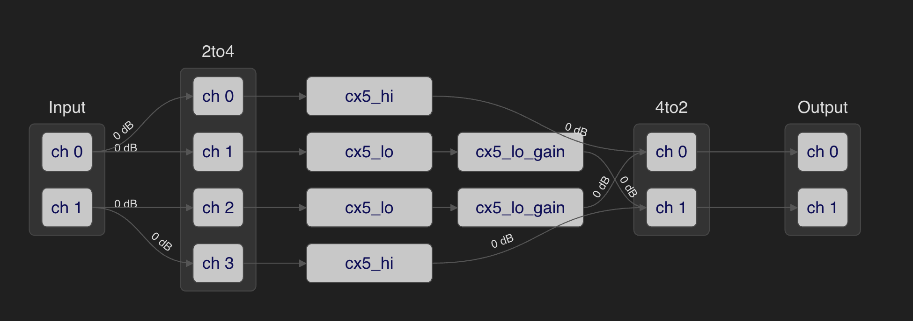
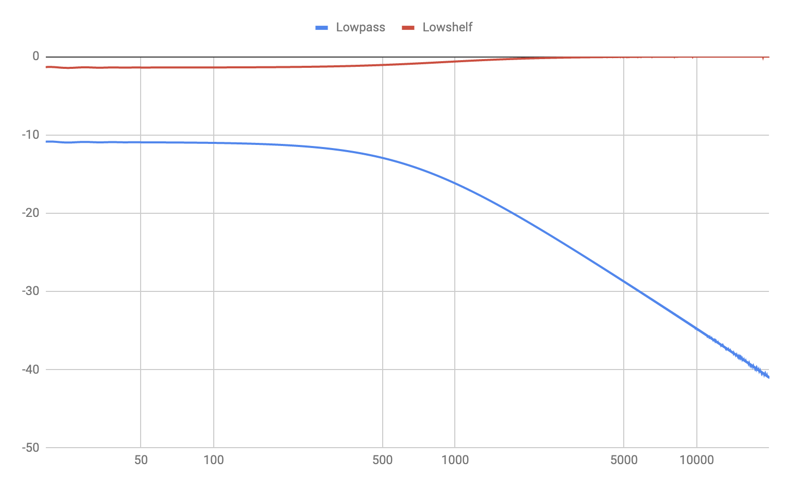

# camilladsp-crossfeed

`bs2b` style crossfeed using CamillaDSP

# Introduction

[Crossfeed](https://en.wikipedia.org/wiki/Crossfeed) is the process of blending the left and right channels of a stereo audio recording.

[The Bauer stereophonic-to-binaural DSP](http://bs2b.sourceforge.net/) is a very useful software library to implement crossfeed. The same code is used in various software projects, such as [ffmpeg](https://www.ffmpeg.org/doxygen/2.5/af__bs2b_8c_source.html) and [gstreamer](https://gstreamer.freedesktop.org/documentation/bs2b/index.html?gi-language=c). Other projects and products mimic the `bs2b` style crossfeed, such as the famous [RME ADI-2 Pro](https://www.rme-audio.de/adi-2-pro-fs-be.html) and [DAC](https://www.rme-audio.de/adi-2-dac.html), which offer `bs2b` style experience in 5 different levels.

While many users enjoy `bs2b` or its variants in various software programs or hardware products, they don't have an integrated solution to use it for all software/hardware. The [CamillaDSP](https://github.com/HEnquist/camilladsp/) project provides a seamless approach to do DSP system-wide on all major desktop operating systems, with various DSP features ready to be used, such as [Loudness](https://en.wikipedia.org/wiki/Loudness_compensation), [Convolution](https://en.wikipedia.org/wiki/Convolution), or [Parametric EQ](https://en.wikipedia.org/wiki/Equalization_(audio)#Parametric_equalizer). There's no built in support for crossfeed but as this project will soon demonstrate, it can achieve identical results compared to `bs2b`.

# The configuration

This project provides [YAML](https://en.wikipedia.org/wiki/YAML) configuration file for CamillaDSP to do crossfeed simulation, in strict `bs2b` style.

Similar to the RME ADI-2 series mentioned above, the same 5 levels of crossfeed are included in the config file:

1. 650 Hz, -13.5 dB (just a touch)
2. 650 Hz, -9.5 dB (Jan Meier emulation)
3. 700 Hz, -6 dB (Chu Moy emulation)
4. 700 Hz, -4.5 dB (30° 3 meter emulation)
5. 700 Hz, -3 dB (example how even stronger would sound)

# How to use it

Just move the filter, mixer, and pipeline sections in `crossfeed.yml` to your own CamillaDSP config file, and start the CamillaDSP program. you can change the `cx1` string in the pipeline section to for instance, to `cx5`, to adjust levels.

The pipeline is very simple and mimics exactly `bs2b`'s filter settings:

# Validation

We can easily validate the setting being identical to `bs2b` by plotting the Frequency-Response graph. For instance, with Level 2 (Jan Meier), when playing sine sweep from the left channel and recording both channels, we can plot the frequency-response for the two filters as below:

The above 5 levels already cover what the official `bs2b` project offers as default set of levels:

1. 700 Hz, 4.5 dB - default.
2. 700 Hz, 6 dB - most popular.
3. 650 Hz, 9.5 dB - making the smallest changes in the original signal only for relaxing listening by headphones.
 
